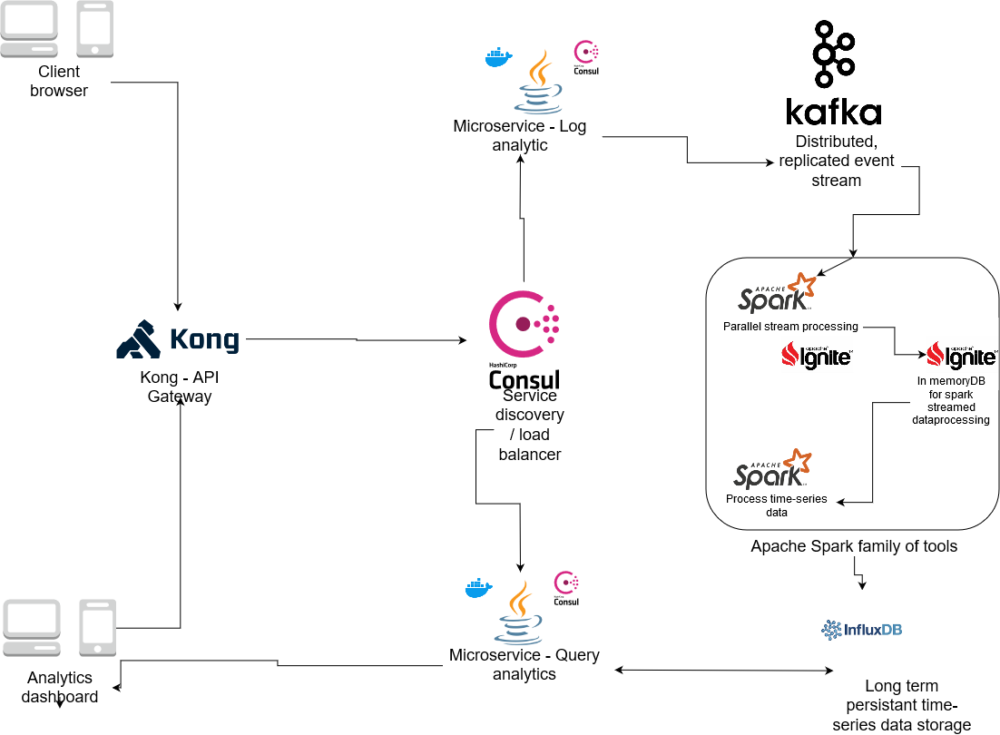

 # High level google analytics style backend system # 

### System components diagram

### Components role and purpose ###

<ul>Kong Api gateway</ul>

<ul>Consul service discovery and load balancing</ul>

<ul>Microservices
    <ul>Log analytics service</ul>
    <ul>Query analytics service</ul>
</ul>

<ul>Kafka event stream</ul>

<ul>Apache spark
    <ul>Parallel stream processing</ul>
    <ul>Ignite - in memory DB</ul>
    <ul>Process time-series data</ul>
</ul>

<ul>InfluxDB</ul>